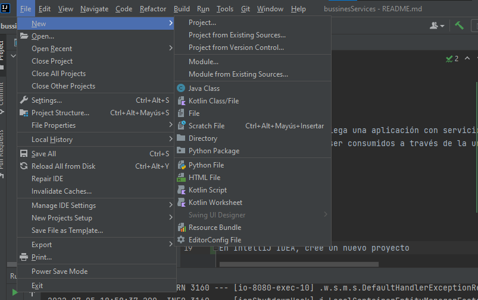
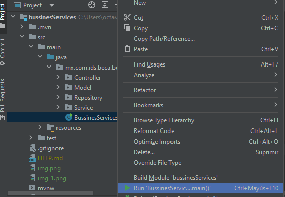

# bussinessServices

* Introducción
* Requerimientos
* Instalación
* Ejecución
* Endpoints
* Formato del JSON

## INTRODUCTION

bussinessServices despliega una aplicación con servicios REST como servicios locales.
Estos servicios pueden ser consumidos a través de la url http://localhost:8080

## REQUERIMIENTOS

* Java 8
* IntelliJ IDEA

## INSTALACIÓN
En IntelliJ IDEA, cree un nuevo proyecto desde Control de Versiones:

Agregue https://github.com/OctavioColin/bussinessServices a la URL del proyecto:

## EJECUCIÓN
Seleccione la carpeta del proyecto "bussinesServices" en el panel lateral. Navegue hasta la carpeta src > main > java > mx.com.ids.beca.bussinesServices.
Posteriormente, de clic derecho sobre BussinesServicesApplication.java y seleccione la opción Run:

## ENDPOINTS
* Employee ("/employee")
    * (GET) "/employeeList": Devuelve una lista con los empleados registrados.
    * (GET) "/employeeDetails/{id}": Devuelve los datos del empleado correspondiente al id ingresado.
    * (DELETE) "/employeeDelete/{id}": Elimina los datos del empleado correspondiente al id ingresado.
    * (PUT) "/employeeUpdate/{id}": Permite modificar los datos del empleado correspondiente al id ingresado, los nuevos datos deben ingresarse en formato JSON en el cuerpo de la petición.
    * (POST) "/apiv1/clientes/add": Inserta los datos de un nuevo empleado. Los datos deben agregarse en formato JSON en el cuerpo de la petición.

## FORMATO DEL JSON
Para agregar datos al json, se debe seguir el siguiente formato:

{
"firstname" : "-",
"surname" : "-",
"country" :
{"name" : "-",
"airports" : [
{"name" : "-"}
]
},
"likedLanguages" : [
{"name" : "-"}
]
}

Reemplace los guiones por los datos deseados.

